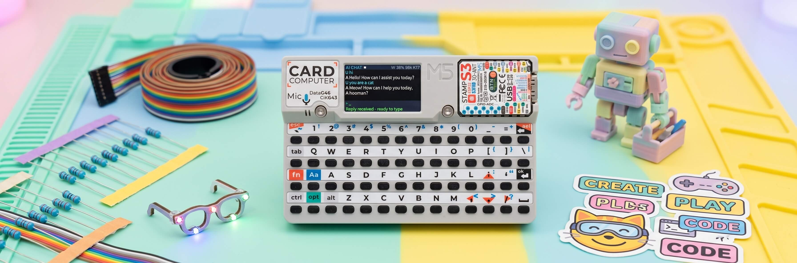

# AI CHAT — M5Stack Cardputer

[](https://docs.micropython.org/)
[](https://aiflow.m5stack.com/)
[](https://docs.m5stack.com/en/device/Cardputer)
[](LICENSE)

<p align="center"></p>

An AI chat client for the **M5Stack Cardputer** running MicroPython / UIFlow2. It connects to any OpenAI-compatible API service (`/chat/completions`) and lets you chat directly from the device's keyboard and 1.28" display.

---

## Features

- 🤖 Chat with any OpenAI-compatible AI service (OpenAI, local Ollama, OpenRouter, etc.)
- 🔧 Web-based configuration UI — change API endpoint, token, and model from any browser on the same WiFi
- 🔑 Simple text input with Enter to send, ESC to clear, Backspace to edit
- 📜 Conversation history (configurable exchange limit and character budget)
- 🔊 Pentatonic sound feedback for keys, send, errors, and ready states
- 💾 Persistent config saved to `chat_config.txt` on the device flash storage
- 📉 Memory-conscious design — heap tracking, automatic history trimming, and lazy module loading

---

## Architecture

```
┌────────────────────────────────────────────────────┐
│                    main.py                         │
│  ┌───────────┐ ┌──────────┐ ┌───────────────────┐  │
│  │  DISPLAY  │ │ KEYBOARD │ │      API CLIENT   │  │
│  │  (M5.Lcd) │ │(MatrixKB)│ │ (requests2 + TLS) │  │
│  └─────┬─────┘ └─────┬────┘ └─────────┬─────────┘  │
│        │             │                │            │
│  ┌─────▼─────────────▼────────────────▼─────────┐  │
│  │              CHAT / CONFIG MODE              │  │
│  │   ┌─────────────────┐    ┌─────────────────┐ │  │
│  │   │    CHAT MODE    │    │   CONFIG MODE   │ │  │
│  │   │  (API chat only)│    │(web server live)│ │  │
│  │   └─────────────────┘    └────────┬────────┘ │  │
│  └───────────────────────────────────┼──────────┘  │
└──────────────────────────────────────┼─────────────┘
                                       │
                              ┌────────▼─────────┐
                              │    webcfg.py     │
                              │(loaded on-demand)│
                              │  HTTP server on  │
                              │   port 80/8080   │
                              └────────┬─────────┘
                                       │
                              ┌────────▼─────────┐
                              │  chat_config.txt │
                              │  (BASE_URL,      │
                              │   TOKEN, MODEL)  │
                              └──────────────────┘
```

### Two Modes

| Mode | Trigger | Behavior |
|------|---------|----------|
| **Chat Mode** | Default on boot | Full-screen AI chat. Web server is **not loaded** to keep heap free for TLS. |
| **Config Mode** | Press **BtnA** | Starts a lightweight HTTP server. A web form lets you edit `BASE_URL`, `TOKEN`, and `MODEL` from any device on the same WiFi network. Press BtnA again to return to chat. |

The web configuration module (`webcfg.py`) is loaded **only** when entering config mode and released when returning to chat mode. This keeps the heap as free as possible for the TLS handshake — the most memory-intensive operation on this device.

---

## Project Structure

```
M5Cardputer-AIChat/
├── src/
│   ├── main.py          # Main application (~1700 lines)
│   ├── webcfg.py        # Web config server (loaded on-demand)
│   └── chat_config.txt  # Template config file (BASE_URL & TOKEN)
└── README.md
```

### `chat_config.txt` fields

```
BASE_URL = https://api.openai.com/v1
TOKEN = sk-your-token-here
MODEL = gpt-4o-mini
SYSTEM_PROMPT = You are a helpful assistant. Answer briefly.
MAX_TOKENS = 320
HISTORY_LIMIT = 8
```

---

## Hardware Requirements

- **M5Stack Cardputer** (ESP32-S3 based, 240×135 OLED, built-in keyboard)
- WiFi connection (pre-configured in UIFlow2)
- An API token from an OpenAI-compatible service

---

## How to Flash

### Prerequisites

1. Install [UIFlow2](https://aiflow.m5stack.com/) and connect your Cardputer via USB.
2. In UIFlow2, select **M5Stack-Carputer** as the device and create a **blank project**.
3. Make sure the **MatrixKeyboard**, **requests2**, and **network** blocks are available in your firmware image.

### Step 1 — Prepare the config file

Edit `src/chat_config.txt` and set your own values for `BASE_URL` and `TOKEN`:

```
BASE_URL = https://your-api-endpoint/v1
TOKEN = Bearer your-api-token-here
MODEL = gpt-4o-mini
```

Save the file.

### Step 2 — Upload config files to the device

1. Connect the Cardputer to UIFlow2 and open the **Web Terminal**.
2. Click the **File** button in the terminal popup — a file browser appears.
3. Navigate to (or create) the folder `flash/res/`.
4. Upload both `chat_config.txt` and `webcfg.py` into that folder.

### Step 3 — Flash the main application

1. Switch the UIFlow2 editor to **Code mode** (Python).
2. Copy the contents of `src/main.py` and paste them into the editor.
3. Click **Flash** to write the program to the Cardputer.

### Step 4 — First run

After flashing, the Cardputer will:
1. Load `chat_config.txt` from `/flash/res/`.
2. Connect to WiFi.
3. Test the API endpoint and show a green dot in the header if the connection is OK.
4. Enter **Chat Mode** ready to type.

> **Important:** After boot the Cardputer keyboard enters a low-power sleep state. Hold **FN** and press any key to wake it up and start receiving input.

---

## Using the App

### Chat Mode

| Key | Action |
|-----|--------|
| **Enter** | Send your message |
| **ESC** | Clear current input |
| **← / →** | Scroll through multi-page AI responses |
| **⌫ (Backspace)** | Delete last character |
| **Fn + any letter** | Type the letter (wake keyboard if needed) |

**Commands** (type then press Enter):

| Command | Description |
|---------|-------------|
| `/clear` | Clear conversation history |
| `/model` | Show the current model name |
| `/beep` | Toggle sound feedback on/off |
| `/keys` | Debug: show keyboard event count |

### Config Mode

Press **BtnA** (the top-left hardware button) to enter config mode. The screen shows the web server address (e.g. `http://192.168.1.42/`). Open that URL from any phone, tablet, or laptop on the same WiFi network. You can edit `BASE_URL`, `TOKEN`, and `MODEL` there. Leave the TOKEN field empty to keep the existing token unchanged.

Press **BtnA** again to return to chat mode — the API will be re-tested automatically.

---

## Troubleshooting

| Symptom | Possible cause |
|---------|----------------|
| Red dot in header, "API error" | Check `BASE_URL` and `TOKEN` in `chat_config.txt` |
| "WiFi not connected" | Enter Config mode and verify the WiFi credentials |
| "requests2 not available" | Use a UIFlow2 firmware that includes the `requests2` module |
| Keyboard does not respond | Hold **FN** and press a key to wake the keyboard driver |
| `chat_config.txt not found` | Make sure the file is uploaded to `/flash/res/` on the device |
| "heap is tight for HTTPS" | The API call may have failed due to low free memory; try reducing `HISTORY_LIMIT` or `MAX_TOKENS` |

---

## Technical Notes

- **requests2** is used instead of `urequests` because it handles JSON payloads natively via the `json=` parameter.
- The API test runs on boot and when re-entering chat mode — **not** while the web server is active. This avoids blocking the config page.
- `free_history()` automatically drops the oldest exchanges when the heap falls below `MEM_MIN` (26 KB), preventing TLS `ENOMEM` failures.
- The web server binds to ports **80 → 8080 → 8000** in that order, trying each until one succeeds.
- All text displayed is passed through `fold_ascii()`, which maps Latin-1 accented characters to their ASCII base forms so the built-in font renders them correctly.

---

## License

MIT License. Feel free to fork, modify, and use for your own projects.
